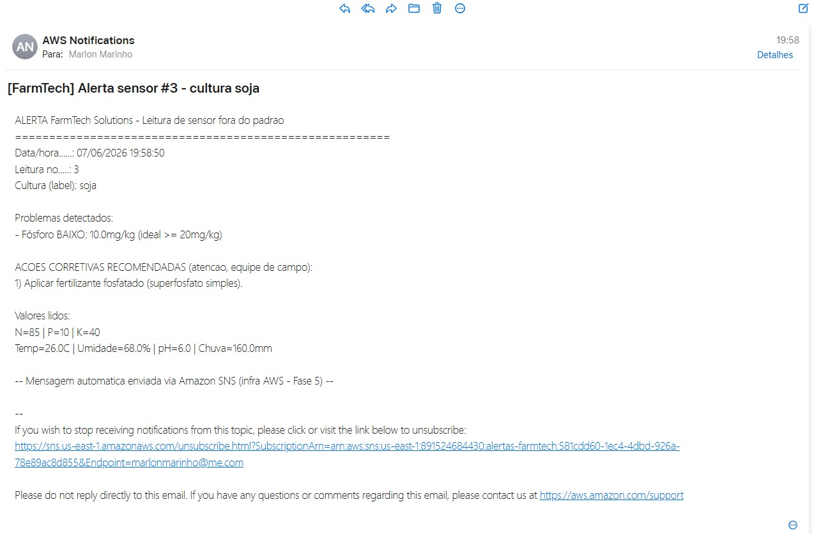

# 📡 Serviço de Mensageria na AWS — Alertas com Ações Corretivas (Amazon SNS)

> **FarmTech Solutions / IA_Underground — FIAP**
> Serviço de mensageria na nuvem que dispara um **alerta por e-mail** sempre
> que uma **leitura de sensor da Fase 3** (N, P, K, temperatura, umidade, pH e
> chuva) sai da **faixa ideal** — e **sugere ao funcionário a ação corretiva**
> que deve ser tomada no campo.

---

## 🎯 Objetivo

Aproveitar a **infraestrutura AWS definida na Fase 5** (conta AWS na nuvem,
região escolhida pelo grupo) para criar um **serviço de mensageria** que:

1. Monitora os dados dos sensores (**Fase 3**);
2. Detecta leituras fora do padrão agronômico;
3. **Envia um e-mail aos funcionários** da fazenda com o problema **e a ação
   corretiva recomendada** (ações definidas pelo grupo);
4. Complementa o **dashboard geral da fazenda (Fase 7)**, levando o alerta
   para fora da tela — direto no e-mail de quem está no campo.

> 🔗 **Ligação com a Fase 5:** na Fase 5 o grupo escolheu a AWS como nuvem do
> projeto (análise de custos de uma EC2 e definição da região). Este serviço
> roda nessa mesma conta AWS, usando o **Amazon SNS** — o serviço gerenciado
> de mensageria da AWS.

O **Amazon SNS (Simple Notification Service)** foi escolhido por ser:

- **Simples** — um tópico + uma assinatura de e-mail e está pronto;
- **Gratuito no Free Tier** — 1.000 e-mails/mês sem custo;
- **Serverless** — sem servidor para manter.

---

## 🧭 Arquitetura da solução

```
┌────────────────────┐   ┌───────────────────────┐   ┌─────────────┐   ┌──────────────────┐
│  Sensores (Fase 3) │   │  alerta_sensor_sns.py │   │  Amazon SNS │   │  E-mail do       │
│  produtos_agricolas│──>│  regras + ações       │──>│  Tópico:    │──>│  funcionário     │
│  .csv (N,P,K,pH...)│   │  corretivas (boto3)   │   │  alertas-   │   │  (problema +     │
│                    │   │                       │   │  farmtech   │   │   ação corretiva)│
└────────────────────┘   └───────────────────────┘   └─────────────┘   └──────────────────┘
   Dashboard Fase 7  ─────────────┘ (mesmo monitoramento, agora notificando por e-mail)
```

1. O script lê o CSV de sensores da Fase 3.
2. Compara cada leitura com as **faixas ideais**.
3. Se algo está fora da faixa, monta a mensagem com **problema + ação corretiva**.
4. **Publica no tópico SNS**, que **reenvia por e-mail** a todos os funcionários inscritos.

---

## 🌡️ Faixas ideais e ações corretivas (definidas pelo grupo)

| Parâmetro | Faixa ideal | Se BAIXO → ação | Se ALTO → ação |
|---|---|---|---|
| Nitrogênio (N) | 30–140 mg/kg | Aplicar adubação nitrogenada (ureia/sulfato de amônio) | Suspender adubação nitrogenada (risco de salinização) |
| Fósforo (P) | 20–100 mg/kg | Aplicar superfosfato | Reduzir adubação fosfatada |
| Potássio (K) | 20–100 mg/kg | Aplicar cloreto/sulfato de potássio | Suspender aplicação de potássio |
| Temperatura | 15–35 °C | Proteger cultura (cobertura/estufa) | Reforçar irrigação/sombreamento |
| Umidade | 40–90 % | **Acionar irrigação imediatamente** | Suspender irrigação; checar drenagem |
| pH do solo | 5,5–7,0 | Aplicar calcário (calagem) | Aplicar enxofre/matéria orgânica |

> As regras e ações ficam no dicionário `FAIXAS_IDEAIS`, no início de
> `alerta_sensor_sns.py` — fácil de ajustar.

---

## 🗂️ Arquivos desta pasta

| Arquivo | Descrição |
|---|---|
| `alerta_sensor_sns.py` | Lê os sensores, monta o alerta com ação corretiva e publica no SNS (tem modo simulação). |
| `setup_sns.sh` / `setup_sns.ps1` | Criam o tópico SNS + assinatura de e-mail com **um comando** (Linux/CloudShell e Windows). |
| `leituras_exemplo.csv` | Leituras variadas (fora da faixa) para demonstrar todos os tipos de alerta. |
| `requirements.txt` | Dependência: `boto3` (SDK da AWS para Python). |
| `assets/previa-email.html` | Prévia dos e-mails gerada localmente (abra no navegador e tire o print). |
| `assets/exemplo-alertas.txt` | Texto dos alertas gerados (sem AWS). |
| `README.md` | Este guia. |

---

## 🔌 Estado atual: **pronto para conectar uma conta AWS**

A solução está **100% implementada e testada localmente**. Quando uma conta
AWS estiver disponível, faltam apenas **2 passos**:

1. Rodar o setup (cria tópico + assinatura): `bash setup_sns.sh seu-email@x.com`
2. Definir `SNS_TOPIC_ARN` + `AWS_REGION` e rodar `python alerta_sensor_sns.py`.

Enquanto isso, é possível **demonstrar e printar tudo sem AWS** com o modo
`--simular` e a prévia em HTML (veja abaixo).

---

## ⚙️ Parte 1 — Configurar a AWS (console)

> **Ambiente usado na entrega:** AWS Academy **Learner Lab** (fornecido pela
> FIAP), região **N. Virgínia (`us-east-1`)**. A região do Learner Lab fica
> travada em `us-east-1` — crie o tópico, a assinatura e rode o script **todos
> nessa mesma região**, senão o tópico "some".

### 0) Abrir o console pelo Learner Lab
No Canvas: módulo **"Laboratório de aprendizagem da AWS Academy" → Iniciar os
laboratórios** → **Start Lab** → espere a bolinha ao lado de **AWS** ficar
**verde** 🟢 → clique em **AWS** para abrir o console.

### 1) Abrir o Amazon SNS
Na busca do console, digite **`SNS`** → **Simple Notification Service**.

> ⚠️ O Learner Lab pode já ter um tópico de outro módulo (ex.: `RedshiftSNS`).
> **Ignore-o** e crie o tópico próprio do projeto no passo seguinte.

### 2) Criar o Tópico
Menu **Tópicos → Criar tópico** → tipo **Standard** → nome `alertas-farmtech`.

### 3) Criar a assinatura de e-mail
No tópico → **Criar assinatura** → protocolo **Email** → informe o e-mail do funcionário.

### 4) Confirmar a inscrição
A AWS envia um e-mail — clique em **Confirm subscription**. O status muda para **Confirmed**.

### 5) Copiar o ARN do tópico
Ex.: `arn:aws:sns:us-east-1:891524684430:alertas-farmtech`.

---

## 💻 Parte 2 — Executar o script (Windows / Learner Lab)

Depois que o tópico está criado e a assinatura **Confirmada**, faltam 3 passos
para o script disparar os e-mails de verdade.

### 1) Instalar a dependência (boto3)
```powershell
pip install boto3
# se "pip" não for reconhecido:
python -m pip install boto3
```

### 2) Configurar as credenciais do Learner Lab
As credenciais do Learner Lab são **temporárias** e mudam a cada sessão do lab.

1. Na página do lab (Canvas), clique em **"AWS Details"** (ao lado do Start Lab).
2. Em **AWS CLI**, clique em **Show** — aparece um bloco assim:
   ```
   [default]
   aws_access_key_id=ASIA...
   aws_secret_access_key=...
   aws_session_token=...
   ```
3. Copie o bloco inteiro e cole no arquivo **`C:\Users\<seu_usuario>\.aws\credentials`**
   (crie o arquivo/pasta se não existir).

> 💡 Toda vez que reabrir o lab, repita este passo — as credenciais expiram
> junto com a sessão.

### 3) Definir as variáveis e rodar
```powershell
cd AWS_Mensageria
$env:SNS_TOPIC_ARN = "arn:aws:sns:us-east-1:891524684430:alertas-farmtech"
$env:AWS_REGION = "us-east-1"
python alerta_sensor_sns.py --csv leituras_exemplo.csv
```

> Troque o **número da conta** (`891524684430`) pelo ID que aparece no seu ARN
> (Parte 1, passo 5).

**Erros comuns:**

| Mensagem | Causa | Solução |
|---|---|---|
| `ERRO: boto3 nao instalado` | faltou o boto3 | rode o passo 1 (`pip install boto3`) |
| `Unable to locate credentials` | faltou o `.aws\credentials` | rode o passo 2 (AWS Details) |
| `security token ... expired/invalid` | sessão do lab expirou | reabra o lab e cole as credenciais novas |
| `NotFound ... Topic does not exist` | região ou ARN errados | confira que `AWS_REGION` e o ARN são `us-east-1` |

> 💡 **Alternativa (sem instalar nada):** o **AWS CloudShell** (ícone `>_` no
> topo do console) já vem autenticado. Suba os arquivos por *Actions > Upload
> file* e rode os mesmos comandos em `bash` (`export VAR=...` no lugar de
> `$env:VAR = ...`).

---

## 🧪 Demonstrar SEM conta AWS (para os prints agora)

Funciona offline e gera os artefatos para a entrega:

```bash
# Mostra na tela os alertas que SERIAM enviados + gera prévia em HTML
python alerta_sensor_sns.py --simular --csv leituras_exemplo.csv \
       --saida assets/exemplo-alertas.txt --html assets/previa-email.html
```

Depois abra `assets/previa-email.html` no navegador e tire o print da
"caixa de entrada" simulada → use como `assets/06-email-recebido.png`.

---

## 📨 Resultado

### Saída do script (terminal)

```
FarmTech Solutions - Monitor de sensores (Fase 3) + Amazon SNS
Arquivo de leituras: ...\AWS_Mensageria\leituras_exemplo.csv
Regiao AWS.........: us-east-1
Topico SNS.........: arn:aws:sns:us-east-1:891524684430:alertas-farmtech
Modo...............: ENVIO REAL
------------------------------------------------------------
>>> Alerta #2 enviado ao SNS. MessageId: 081d4caa-5d23-5318-8714-2e35a4c9c49c
>>> Alerta #3 enviado ao SNS. MessageId: 6e030b78-c15b-5a9b-b58e-69e738b0b93d
>>> Alerta #4 enviado ao SNS. MessageId: ac8345c1-d252-5457-95d6-275e2bbe69d0
>>> Alerta #5 enviado ao SNS. MessageId: 73412b36-4442-51c5-ba3b-49a9bdacb61b
>>> Alerta #6 enviado ao SNS. MessageId: 1b6147c5-255a-5f1f-8c95-255adcb594fb
>>> Alerta #7 enviado ao SNS. MessageId: 3c31c0ac-3092-5d07-9ebb-a233c962a245
>>> Alerta #8 enviado ao SNS. MessageId: def06380-40be-5a37-bed2-011fb94fff3c
------------------------------------------------------------
Leituras analisadas: 8 | Alertas gerados: 7
```

> Execução real no AWS Academy Learner Lab (região `us-east-1`): 7 leituras fora
> da faixa geraram 7 publicações no SNS, cada uma com seu `MessageId`.

### Caixa de entrada do funcionário (e-mails reais recebidos)

Os 7 alertas chegaram por e-mail, enviados pelo **AWS Notifications** (Amazon SNS):

<p align="center">
  
</p>

### E-mail de alerta aberto (problema + ação corretiva)

Cada e-mail traz o problema detectado e a ação corretiva recomendada para a
equipe de campo:

<p align="center">
  
  
</p>

---

## ✅ Resumo

Aproveitando a conta AWS definida na **Fase 5**, montamos um **serviço de
mensageria serverless** com o **Amazon SNS**: o script lê os sensores da
**Fase 3**, aplica regras agronômicas e envia ao **funcionário** um e-mail
com o **problema e a ação corretiva** a executar — integrando o
monitoramento do **dashboard da fazenda (Fase 7)** com notificações que
chegam a quem está no campo. Barato, simples e sem servidores para gerenciar.
