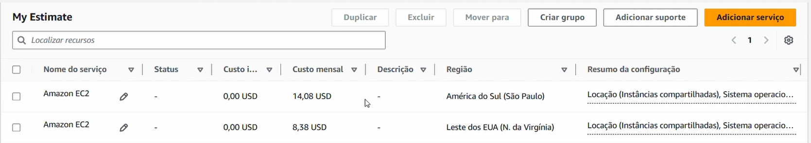

# FIAP - Faculdade de Informática e Administração Paulista

 

## IA_Underground

## 👨‍🎓 Integrantes: 

- <a href="https://www.linkedin.com/in/marlonmarinho/">Marlon Paulino Marinho</a>
- <a href="https://www.linkedin.com/in/pedro-carvalho-cea-149658137/">Pedro Carvalho Rocha Lima</a> 
- <a href="https://www.linkedin.com/in/vinigama">Vinicius de Santana Gama</a>

## 📜 Descrição

Bem-vindo ao nosso reposiório de atividades do curso de Inteligência Artifical da FIAP ON.

## 📁 Estrutura de pastas

Dentre os arquivos e pastas presentes na raiz do projeto, definem-se:

- <b>assets</b>: Todas imagens do projeto

- <b>FarmTech_na_Era_da_Cloud_Computing</b>: Base do Projeto

- <b>README.md</b>: Arquivo que serve como guia e explicação geral sobre o projeto (o mesmo que você está lendo agora).

# Entrega 1
## 🌱 Projeto FarmTech Solutions - Machine Learning

Este projeto tem como objetivo analisar dados de condições climáticas e de cultivo para prever o rendimento agrícola (Yield) de diferentes culturas.

Foram aplicadas técnicas de análise exploratória, clusterização e modelos de regressão supervisionada para identificar padrões e selecionar o melhor modelo preditivo.

---

## 📊 Tecnologias utilizadas

- Python
- Pandas
- NumPy
- Matplotlib / Seaborn
- Scikit-learn

---

## 📓 Notebook

A análise completa está disponível no notebook

## 🤖 Modelos utilizados

Foram testados os seguintes modelos:

- Linear Regression
- Decision Tree Regressor
- Random Forest Regressor
- SVR
- Gradient Boosting Regressor

---

## 📈 Resultados

O modelo **Random Forest** apresentou o melhor desempenho:

- Menor erro (MAE)
- Alto coeficiente de determinação (R²)

O modelo SVR apresentou desempenho insatisfatório.

---

## 🧠 Principais insights

- As variáveis climáticas possuem baixa correlação com o rendimento (Yield)
- O tipo de cultura (Crop) tem forte influência no resultado
- Existem outliers significativos na variável Yield

---

## 🎥 Vídeo demonstrativo

<a href="https://youtu.be/w8Zcf0X_dA8">Link do vídeo demonstrando o ML</a>

## Link notbook colab

---

# Entrega 2
## 💰 Comparação de Custos AWS

Utilizamos a AWS Pricing Calculator para estimar custos de uma instância EC2 com:

- 2 vCPU

- 1 GiB RAM

- 50 GB armazenamento

- Linux

- Uso contínuo (On-Demand)

## 🌎 Resultados
Região	Custo estimado:

- São Paulo (BR)	Maior custo

- Virgínia (EUA)	Menor custo

 

## 🧠 Análise

A região da Virgínia apresentou menor custo devido à maior escala da infraestrutura da AWS.

## ⚖️ Escolha Final

Apesar do custo mais elevado, escolhemos a região de São Paulo devido a:

- Menor latência para sensores

- Atendimento à Lei Geral de Proteção de Dados

- Maior confiabilidade

- Conformidade legal

## 🎥 Vídeo

- <a href="https://youtu.be/7zVw3dtK28c">Link do vídeo demonstrando a simulação na AWS Pricing Calculator</a>

  
