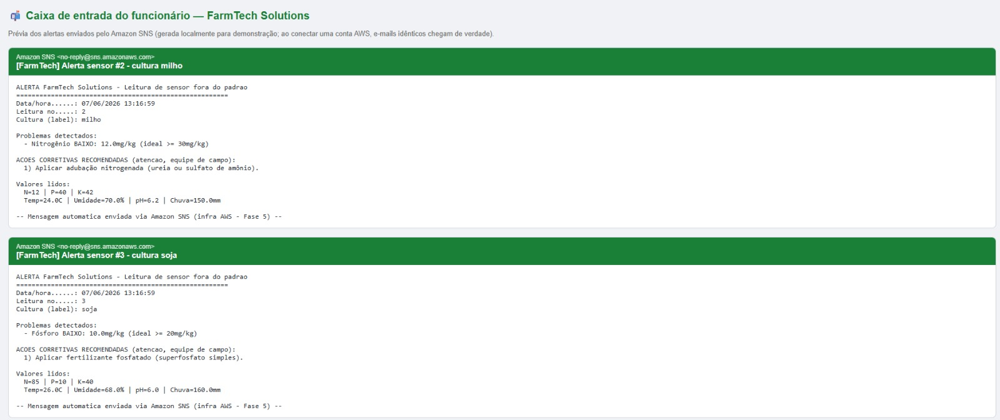

# FarmTech Solutions — IA_Underground (FIAP)

Repositório de atividades do curso de Inteligência Artificial da FIAP.
Sistema integrado de agricultura de precisão: sensores, machine learning,
visão computacional, nuvem e um dashboard central.

---

## 🗂️ Fases do projeto

| Fase | Tema | Tecnologias |
|---|---|---|
| **1** | Gestão de áreas e insumos | Python (CLI), R |
| **2** | Sensores IoT (ESP32) + banco Oracle | C/Arduino, Python, Oracle |
| **3** | Classificação de culturas (ML) | Python, scikit-learn |
| **4** | Dashboard ML de irrigação | Streamlit, scikit-learn |
| **5** | Previsão de rendimento na nuvem (AWS) | Python, AWS (custos) |
| **6** | Visão computacional (YOLO) | PyTorch, Ultralytics |
| **7** | Launcher central de todas as fases | Python, Streamlit |
| **📡 AWS** | **Mensageria de alertas (Amazon SNS)** | **Python (boto3), Amazon SNS** |

---

## 📡 Mensageria na AWS — Alertas com ações corretivas

Serviço de mensageria na nuvem que **dispara alerta por e-mail (Amazon SNS)**
sempre que uma **leitura de sensor da Fase 3** sai da faixa ideal, **sugerindo
ao funcionário a ação corretiva** a executar no campo. Aproveita a conta AWS
definida na **Fase 5** e complementa o **dashboard da fazenda (Fase 7)**.

```
Sensores (Fase 3)  ->  Python (boto3 + regras + ações)  ->  Amazon SNS  ->  E-mail do funcionário
```

➡️ **Solução completa, passo a passo, código e prints:**
[AWS_Mensageria/README.md](AWS_Mensageria/README.md)

<p align="center">
  
</p>

---

## 👨‍🎓 Integrantes — IA_Underground

- Marlon Paulino Marinho
- Pedro Carvalho Rocha Lima
- Vinicius de Santana Gama
- Danilo Marques Dantas
- Vinicius Lisboa Porto
