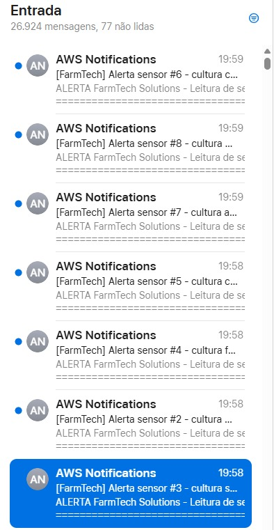
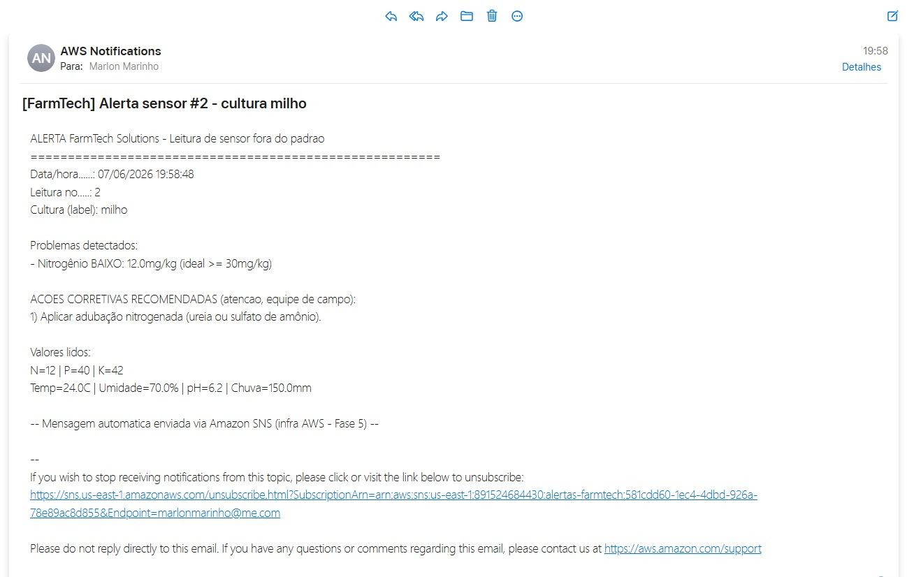

# FIAP - Faculdade de Informática e Administração Paulista

<p align="center">
<a href= "https://www.fiap.com.br/"></a>
</p>

<br>

## IA_Underground — FarmTech Solutions

Sistema integrado de **agricultura de precisão**: sensores IoT, machine
learning, visão computacional, nuvem (AWS) e um **dashboard central** que reúne
todas as fases do projeto.

## 👨‍🎓 Integrantes:

- <a href="https://www.linkedin.com/in/marlonmarinho/">Marlon Paulino Marinho</a>
- <a href="https://www.linkedin.com/in/pedro-carvalho-cea-149658137/">Pedro Carvalho Rocha Lima</a>
- <a href="https://www.linkedin.com/in/vinigama">Vinicius de Santana Gama</a>
- Danilo Marques Dantas
- Vinicius Lisboa Porto

## 📜 Descrição

Bem-vindo ao nosso repositório de atividades do curso de Inteligência Artificial
da FIAP ON. O projeto **FarmTech Solutions** evoluiu fase a fase até virar um
sistema integrado de gestão agrícola inteligente, com um **launcher central
(Fase 7)** que executa qualquer módulo a partir de um único comando, e um
**serviço de mensageria na AWS (Amazon SNS)** que leva os alertas dos sensores
direto para o e-mail de quem está no campo.

## 🗂️ Fases do projeto

| Fase | Tema | Tecnologias |
|---|---|---|
| **1** | Gestão de áreas e insumos | Python (CLI), R |
| **2** | Sensores IoT (ESP32) + banco Oracle | C/Arduino, Python, Oracle |
| **3** | Classificação de culturas (ML) | Python, scikit-learn |
| **4** | Dashboard ML de irrigação | Streamlit, scikit-learn |
| **5** | Previsão de rendimento na nuvem (AWS) | Python, AWS (análise de custos) |
| **6** | Visão computacional (YOLO) | PyTorch, Ultralytics |
| **7** | Launcher central de todas as fases | Python, Streamlit |
| **📡 AWS** | **Mensageria de alertas (Amazon SNS)** | **Python (boto3), Amazon SNS** |

## 📁 Estrutura de pastas

Dentre os arquivos e pastas presentes na raiz do projeto, definem-se:

- <b>FASE1</b>: Gestão de áreas e insumos (Python CLI) + scripts R (clima e análise).
- <b>FASE2</b>: Sensores IoT com ESP32 e CRUD de sementes em banco Oracle.
- <b>FASE3</b>: Classificação de culturas com 5 algoritmos de machine learning.
- <b>FASE4</b>: Dashboard de irrigação (Streamlit) com modelos de umidade/irrigação.
- <b>FASE5</b>: Previsão de rendimento na nuvem e análise de custos AWS.
- <b>FASE6</b>: Visão computacional com YOLO (dataset customizado).
- <b>FASE7</b>: **Launcher central** — inicia qualquer fase por um único menu/painel.
- <b>AWS_Mensageria</b>: **Serviço de mensageria (Amazon SNS)** com alertas e ações corretivas.
- <b>gerar_guia.py</b>: Gera o guia de instalação do projeto (`Guia_Instalacao_FarmTech.docx`).
- <b>requirements.txt / requirements-cv.txt</b>: Dependências do projeto (geral e visão computacional).
- <b>README.md</b>: Este guia geral do projeto.

## 🎛️ Fase 7 — Launcher central

A Fase 7 é o **painel de controle** de todo o projeto: em vez de navegar pasta a
pasta e rodar cada script separadamente, um sistema centralizado permite iniciar
qualquer fase (1 a 6) com um único comando, configurável pelo `FASE7/config.json`.

➡️ **Passo a passo e como rodar:** [FASE7/README.md](FASE7/README.md)

## 📡 Mensageria na AWS — Alertas com ações corretivas

Serviço de mensageria na nuvem que **dispara alerta por e-mail (Amazon SNS)**
sempre que uma **leitura de sensor da Fase 3** sai da faixa ideal, **sugerindo
ao funcionário a ação corretiva** a executar no campo. Aproveita a conta AWS
definida na **Fase 5** e complementa o **dashboard da fazenda (Fase 7)**.

```
Sensores (Fase 3)  ->  Python (boto3 + regras + ações)  ->  Amazon SNS  ->  E-mail do funcionário
```

➡️ **Solução completa, passo a passo, código e prints:**
[AWS_Mensageria/README.md](AWS_Mensageria/README.md)

<p align="center">
  
  
</p>

## 🗃 Histórico de lançamentos

* 0.3.0 - 07/06/2026 — Fase 7 (launcher central) e serviço de mensageria AWS (Amazon SNS) com alertas e ações corretivas.
* 0.2.0 - Fases 5 e 6 (nuvem/custos AWS e visão computacional com YOLO).
* 0.1.0 - 14/10/2025 — Fases 1 a 4 (gestão, IoT/Oracle, ML e dashboard de irrigação).
